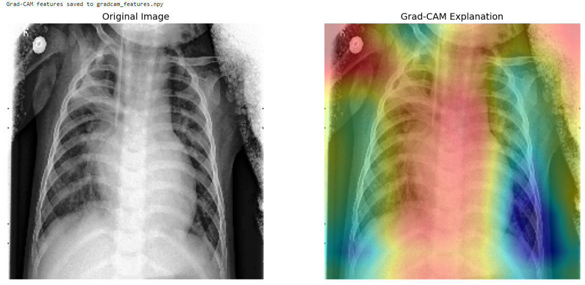
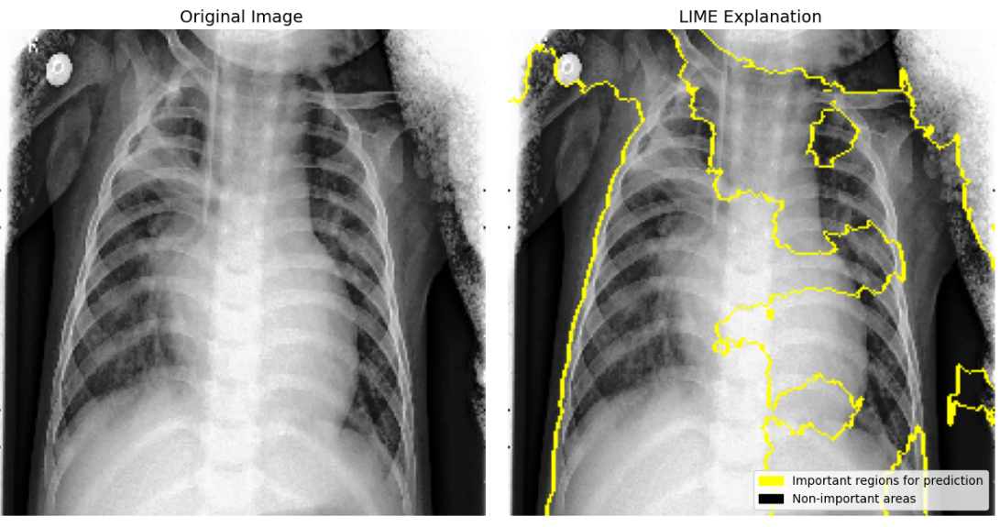
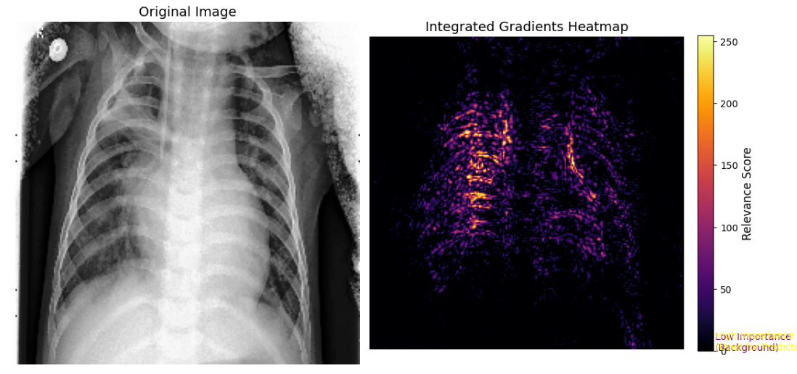
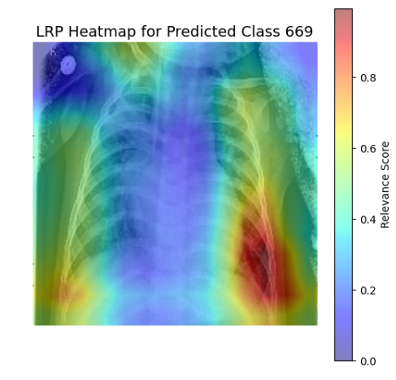
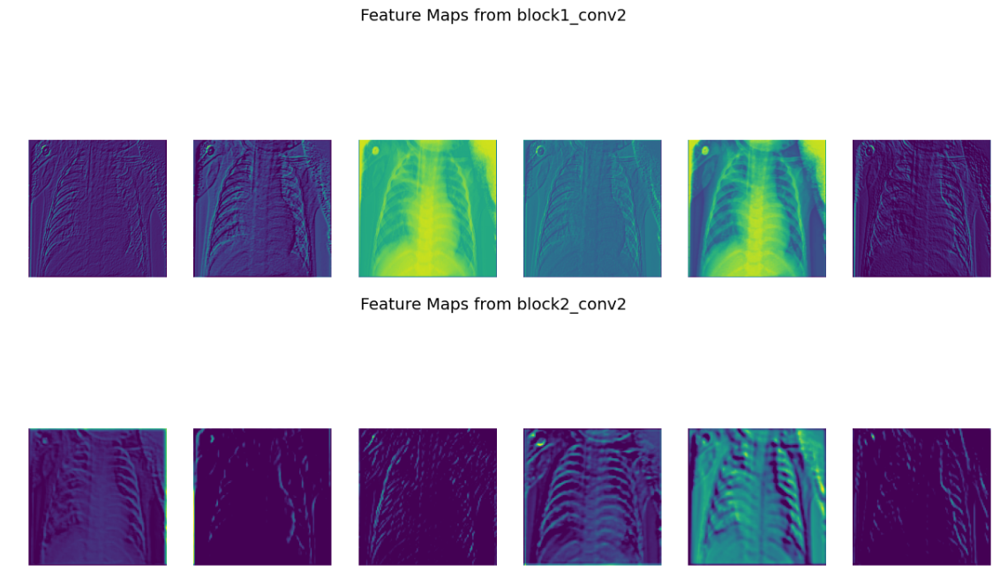
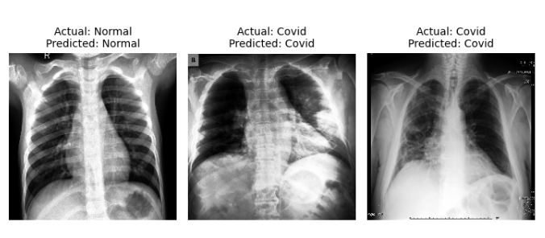
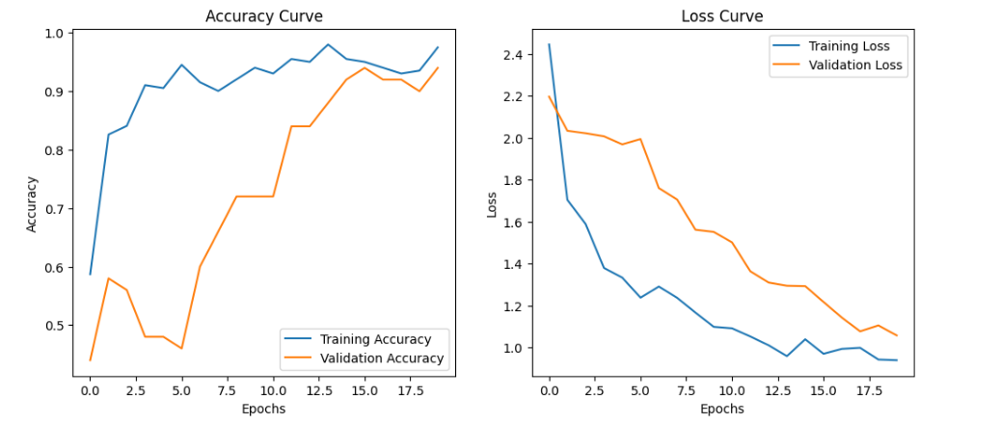

# 🫁 Lung Disease Detection and Classification using Deep Learning with Explainable AI (XAI)

> A Deep Learning-based diagnostic system that classifies chest X-ray images into **COVID-19**, **Pneumonia**, and **Normal** categories using a fine-tuned **VGG19** model, integrated with multiple **Explainable AI (XAI)** techniques for transparent and trustworthy predictions.

---

## 📖 Project Overview

Artificial Intelligence has become an essential tool in modern healthcare, especially in medical image analysis. However, achieving high classification accuracy alone is insufficient for real-world clinical adoption. Healthcare professionals need to understand **why** a model makes a particular prediction before trusting its recommendations.

This project presents an intelligent diagnostic system that leverages a **VGG19 Convolutional Neural Network** to classify chest X-ray images into three categories:

- 🦠 COVID-19
- 🫁 Pneumonia
- ✅ Normal

To improve interpretability and clinical transparency, the model incorporates multiple **Explainable AI (XAI)** techniques that visually and analytically explain the reasoning behind each prediction. These explanations help bridge the gap between deep learning models and healthcare professionals, making AI-assisted diagnosis more reliable and trustworthy.

---

# 🚀 Features

- ✅ Multi-class lung disease classification
- ✅ Transfer Learning using VGG19
- ✅ Chest X-ray preprocessing and augmentation
- ✅ Fine-tuned CNN architecture
- ✅ Multiple Explainable AI (XAI) techniques
- ✅ Feature map visualization
- ✅ Training & validation performance visualization
- ✅ Clinically interpretable predictions

---

# 🧠 Model Architecture

The classification model is based on **VGG19**, a deep Convolutional Neural Network pre-trained on ImageNet.

### Transfer Learning Pipeline

- Load pre-trained VGG19 weights
- Freeze initial convolutional layers
- Replace the original classifier with custom dense layers
- Fine-tune the network on chest X-ray images
- Use Softmax activation for three-class classification

---

# 📂 Dataset

The dataset contains chest X-ray images divided into three categories.

| Class | Description |
|--------|-------------|
| COVID-19 | Chest X-rays of COVID-19 infected patients |
| Pneumonia | Chest X-rays showing Pneumonia |
| Normal | Healthy chest X-rays |

---

# ⚙️ Data Preprocessing

Before training, the dataset undergoes several preprocessing steps:

- Image resizing
- Pixel normalization
- Data augmentation
  - Rotation
  - Horizontal Flip
  - Zoom
  - Width Shift
  - Height Shift
- Batch generation

These preprocessing techniques improve model robustness and reduce overfitting.

---

# 🛠️ Tech Stack

- Python
- TensorFlow
- Keras
- VGG19
- NumPy
- Pandas
- Matplotlib
- OpenCV
- Scikit-learn
- LIME
- Captum
- Jupyter Notebook

---

# 🔍 Explainable AI (XAI) Techniques

One of the key objectives of this project is to make deep learning predictions transparent and understandable. The following XAI methods were implemented.

---

## 📌 Grad-CAM

Gradient-weighted Class Activation Mapping highlights the important regions of a chest X-ray that influenced the model's prediction.

<p align="center">

</p>

---

## 📌 LIME (Local Interpretable Model-Agnostic Explanations)

LIME explains an individual prediction by approximating the complex deep learning model with a locally interpretable surrogate model.

<p align="center">

</p>

---

## 📌 Integrated Gradients

Integrated Gradients attribute prediction importance to every input pixel by integrating gradients from a baseline image to the input image.

<p align="center">

</p>

---

## 📌 Layer-wise Relevance Propagation (LRP)

LRP propagates the prediction backward through the network to identify which pixels contributed the most to the final prediction.

<p align="center">

</p>

---

## 📌 Feature Map Visualization

Feature map visualization helps understand how different convolutional layers extract meaningful features from chest X-ray images.

<p align="center">

</p>

---

## 📌 Predicted Class

Displays the final predicted disease category generated by the trained VGG19 model.

<p align="center">

</p>

---

# 📊 Model Performance

The model performance is evaluated using training and validation metrics.

### Accuracy & Loss Curve

<p align="center">

</p>

---

## 📈 Evaluation Metrics

The model is evaluated using:

- Accuracy
- Precision
- Recall
- F1-Score
- Confusion Matrix

---

# 📁 Project Structure

```text
Lung-disease-detection-and-classification-with-XAI-techniques/
│
├── Images/
│   ├── accuracy_loss.png
│   ├── feature_map.png
│   ├── grad_cam.png
│   ├── integrated_gradient.png
│   ├── lime.png
│   ├── lrp_heatmap.png
│   ├── lung_dataset.png
│   └── predicted_class.png
│
├── main.ipynb
├── README.md
└── requirements.txt
```

---


# 👩‍💻 Author

**Riya S Menon**

**B.Tech Computer Science and Engineering (Artificial Intelligence & Machine Learning)**
